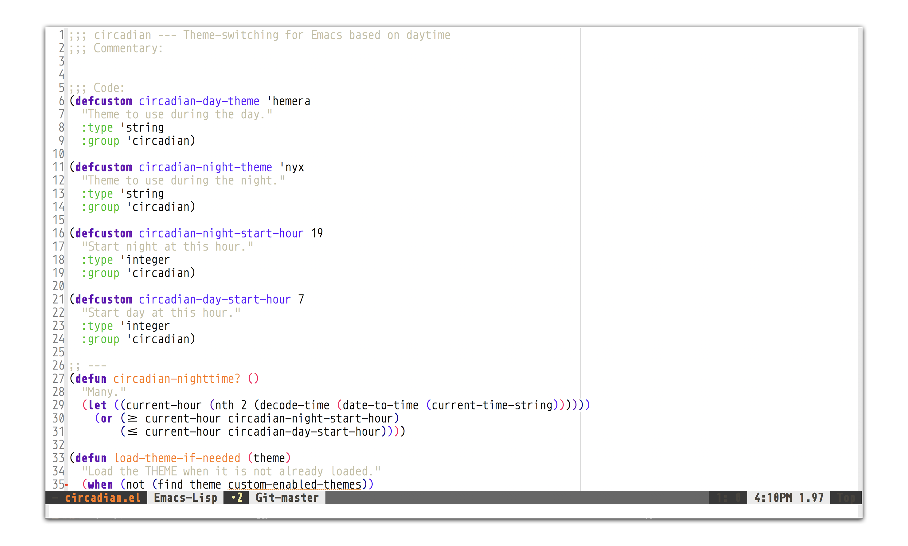

# circadian.el
> Theme-switching for Emacs based on daytime


### Why?
Circadian tries to help reducing eye strain that may arise
from difference of your display brightness and the
surrounding light.

Inspired by color temperature shifting tools and brightness
adaption software like:
- [redshift](https://wiki.archlinux.org/index.php/Redshift)
- [f.lux](https://justgetflux.com/news/pages/mac/)
- [Lumen](https://github.com/anishathalye/lumen)

### Usage
- Clone this repository into your `.emacs.d/` directory
- Add this to your `init.el` (with use-package):

```elisp
(use-package circadian
  :load-path "~/.emacs.d/circadian/"
  :config
  (setq circadian-day-start-hour 8)
  (setq circadian-day-theme 'hemera)
  (setq circadian-night-start-hour 21)
  (setq circadian-night-theme 'nyx))
```

---

### Themes
Circadian features two themes: Nyx & Hemera

#### Nyx (Nighttime)


#### Hemera (Daytime)


---

### TODO
- Better settings for daytimes (day/night), with minutes
- Find another way to switch themes than using switch-buffer? Hook for clock?
- Possible to interpolate-colors?
